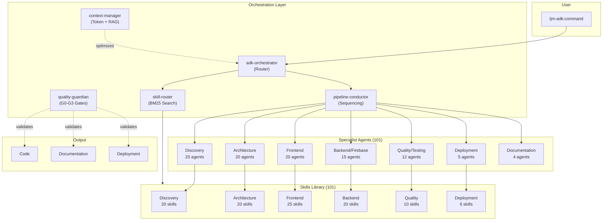
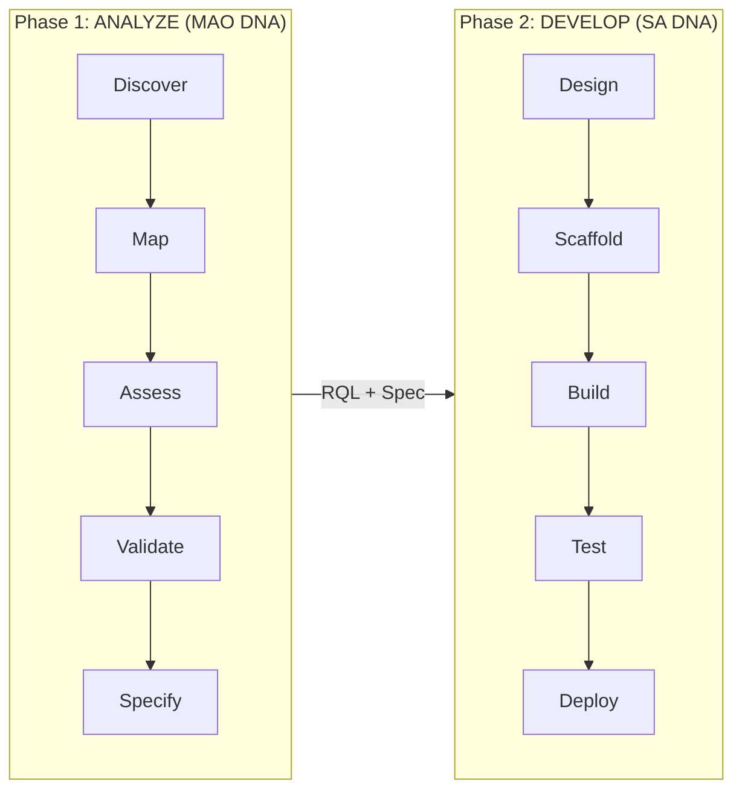
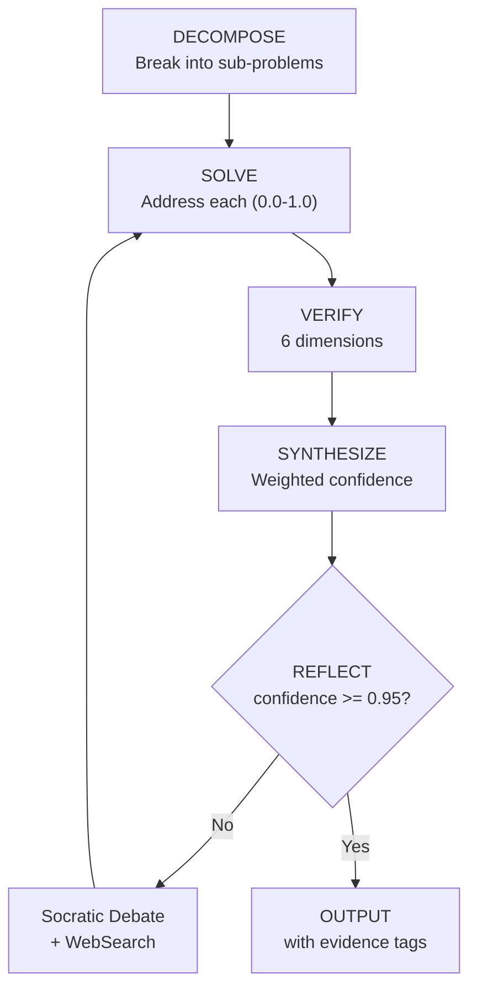
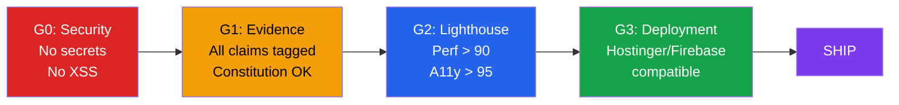
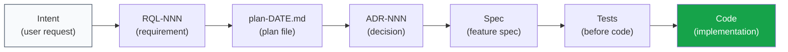
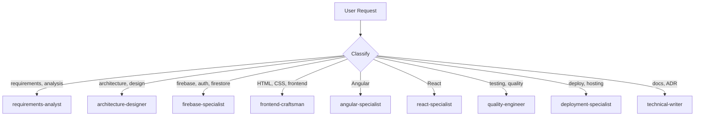
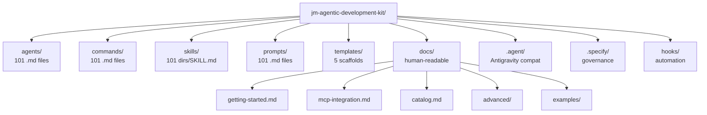

# JM-ADK Architecture

Visual overview of how the kit works.

## System Overview

## Two-Phase Pipeline

## Metacognition Cycle (DSVSR)

## Quality Gates

## Intent Integrity Chain

## Agent Routing

## File Organization

---

*Made with Claude Code and Tons of Love with the Help of Pristino Agent*
