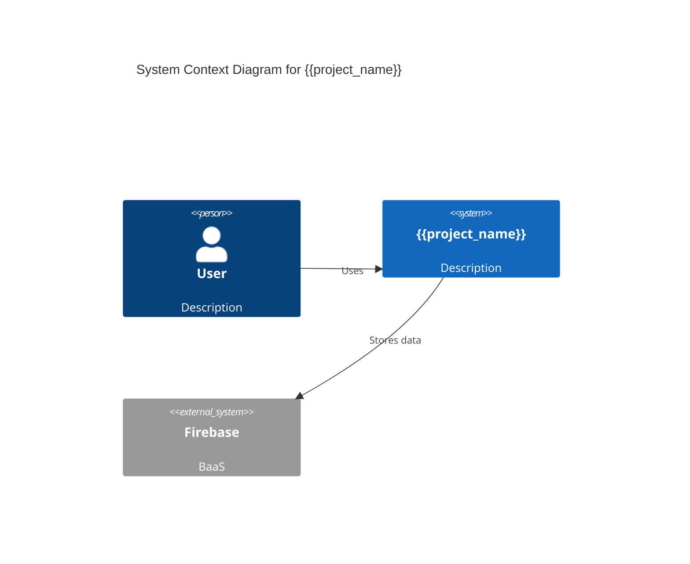
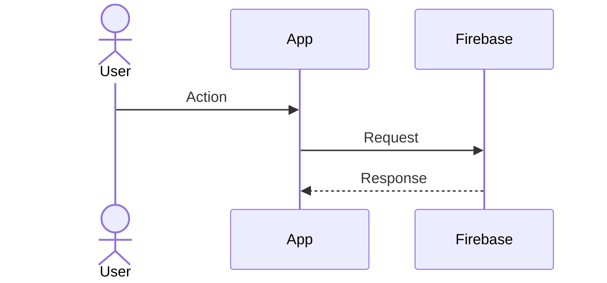
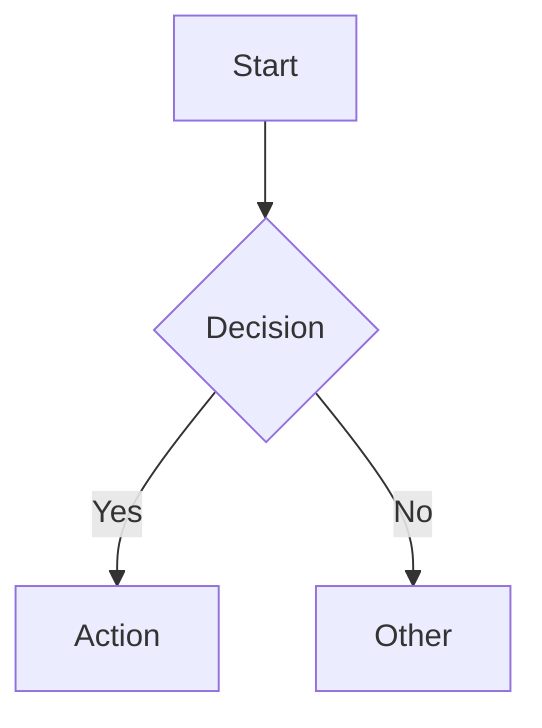
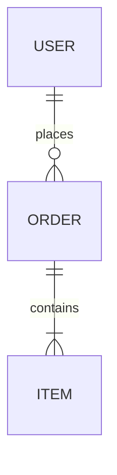
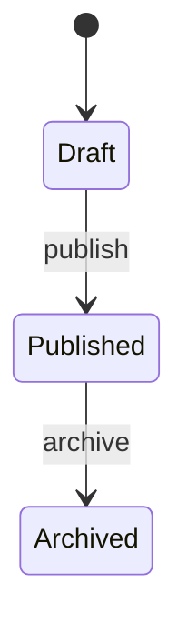

# Generate Diagram

## Context

You are the `diagram-generator` agent in the JM Agentic Development Kit.
Stack: Firebase + HTML/CSS/JS + Angular/React. Deployment: Hostinger or Firebase Hosting.

## Prompt

Generate a **{{diagram_type}}** diagram for **{{project_name}}**:

Subject:
```
{{subject}}
```

Supported diagram types and their output:

### C4 Context Diagram


### Sequence Diagram


### Flowchart


### Entity Relationship


### State Diagram


Generate the diagram with:
1. Proper labels and descriptions
2. Color coding where supported
3. Clear relationship labels
4. Notes for complex interactions
5. Multiple views if the system is complex

## Expected Output

- Mermaid diagram code block(s)
- Diagram legend/key
- Brief description of what the diagram shows
- Suggestions for additional diagrams that would be useful

## Variables

| Variable | Description | Example |
|----------|-------------|---------|
| `{{project_name}}` | Name of the project | "OrderSystem" |
| `{{diagram_type}}` | Type of diagram | "sequence" |
| `{{subject}}` | What to diagram | "User checkout flow" |
